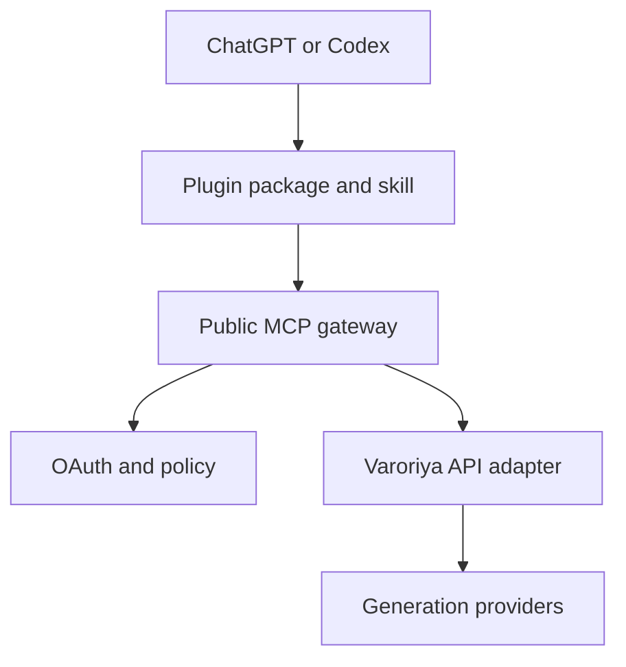

# Varoriya ChatGPT Plugin

Public engineering repository for the Varoriya media-generation plugin for ChatGPT and Codex.

Status: release candidate — production adapters, operations wiring, release tests, and bilingual guides are implemented; production deployment and directory submission remain gated by publisher-owned external inputs and approvals.

## Scope

Version 1 targets eight MCP tools for model discovery, live quotes, balance lookup, secure uploads, image/video/audio generation, and asynchronous job retrieval. Every credit-consuming action requires an explicit quote-confirm-generate sequence.

Out of scope for Version 1: billing writes, API-key management, model registry administration, gallery/social features, and autonomous retries that could create duplicate charges.

## Architecture



The MCP gateway is the public trust boundary. It validates OAuth audience and scopes, resource ownership, tool input, quote tokens, idempotency keys, upload safety, and cost limits before calling the Varoriya API.

## Governance

- GitHub Issues are the source of work status.
- Every issue records Severity, Phase, Human Owner, Sub-Agent, Dependencies, ISO Mapping, acceptance criteria, and evidence.
- Human owners retain approval authority. Sub-Agents produce drafts, code, tests, and review evidence but cannot approve security risk, production release, spend, legal terms, or directory publication.
- No open SEV-0 issue may cross a release gate. A SEV-1 issue requires remediation or documented risk acceptance by an authorized human.

See [implementation plan](docs/project/IMPLEMENTATION_PLAN.md), [project setup](docs/project/PROJECT_SETUP.md), and [contributing guide](CONTRIBUTING.md).

## Repository map

- `docs/architecture/` — trust boundaries and architecture decisions
- `docs/requirements/` — requirements and MCP tool contracts
- `docs/compliance/` — ISO mapping and evidence index
- `docs/project/` — roadmap, backlog, project fields, and release gates
- `.github/ISSUE_TEMPLATE/` — task, bug, risk, and change-control templates
- `server/` — TypeScript MCP gateway, Varoriya adapter, security policies, and tests
- `plugins/varoriya-generate/` — plugin manifest and quote-first generation workflow skill
- `.github/workflows/` — repeatable CI verification
- `docs/guides/` — English and Thai end-user/admin guides
- `docs/publishing/` — listing copy, legal gate, submission guide, and release notes
- `deploy/` — hardened production composition reference

## Local verification

```bash
cd server
npm ci
npm run typecheck
npm test
npm run build
cd ..
node scripts/validate-plugin.mjs
node scripts/release/validate-submission.mjs
```

The automated server suite uses local fixtures and does not spend Varoriya credit. `validate-submission.mjs` intentionally fails while publisher-owned URLs, identity, authorization, or reviewer evidence remain unresolved.

Production startup uses PostgreSQL-backed ownership/quote/cost/idempotency controls and ClamAV scanning. Publication still requires confirmed Varoriya OAuth-to-REST behavior, a publisher-owned public HTTPS origin, OpenAI account/domain verification, legal/support/logo assets, reviewer access, manual interoperability evidence, and authorized human approval.

Start with the [end-user guide](docs/guides/USER_GUIDE_EN.md), [Thai end-user guide](docs/guides/USER_GUIDE_TH.md), [administrator guide](docs/guides/ADMIN_DEVELOPER_GUIDE_EN.md), and [submission guide](docs/publishing/SUBMISSION_GUIDE.md).

## Security and data classification

This is a public repository. Do not commit secrets, OAuth credentials, reviewer accounts, user prompts, user media, signed URLs, production logs, personal data, or confidential vendor information. Report vulnerabilities according to [SECURITY.md](SECURITY.md).

## License

No license is granted until the repository owner publishes an explicit license file.
